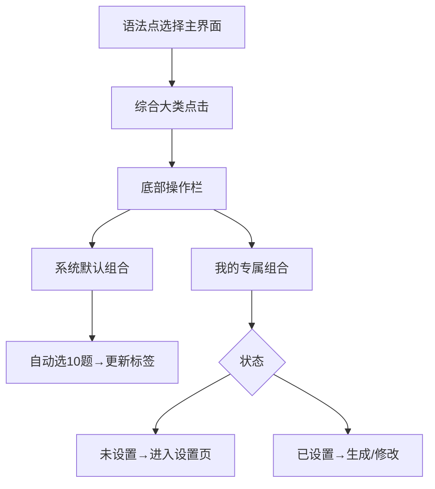

# 语法点选择界面 - 综合大类双按钮功能

## 功能概述

本功能为语法点选择界面添加了综合大类的双按钮操作，包括：
- **系统默认组合**：按照预设规则自动生成10题
- **我的专属组合**：用户自定义语法点组合

## 功能架构



## 实现文件

### 1. 主页面文件
- `miniprogram/pages/grammar-select/index.js` - 主要逻辑
- `miniprogram/pages/grammar-select/index.wxml` - 界面结构
- `miniprogram/pages/grammar-select/index.wxss` - 样式文件

### 2. 专属组合设置页面
- `miniprogram/pages/custom-combo-setting/index.js` - 设置逻辑
- `miniprogram/pages/custom-combo-setting/index.wxml` - 设置界面
- `miniprogram/pages/custom-combo-setting/index.wxss` - 设置样式
- `miniprogram/pages/custom-combo-setting/index.json` - 页面配置

### 3. 应用配置
- `miniprogram/app.json` - 注册新页面

## 核心功能

### 1. 系统默认组合

**选题规则（固定10题）：**
- 介词：随机选1个子点（排除"XX综合"类）
- 代词：随机选1个子点（排除"XX综合"类）
- 连词：随机选1个子点（排除"XX综合"类）
- 冠词：随机选1个子点（排除"XX综合"类）
- 名词：随机选1个子点（排除"XX综合"类）
- 动词：随机选1个子点（排除"XX综合"类）
- 谓语：随机选1个子点（排除"XX综合"类）
- 非谓语：现在分词、过去分词、不定式各选1题
- 形容词：随机选1个子点（排除"XX综合"类）
- 定语从句：随机选1个子点（排除"XX综合"类）

**交互流程：**
1. 点击"综合"大类
2. 底部弹出操作栏
3. 点击"系统默认组合"按钮
4. 自动生成10题并更新标签
5. 显示成功提示

### 2. 我的专属组合

**状态管理：**
- **未设置**：按钮灰色，点击后弹窗提示进入设置
- **已设置**：按钮蓝色，点击后可选择生成或修改

**设置页面功能：**
- 12个语法大类，每个可设置0-20题
- 实时显示总题数（最大20题）
- 支持清空和保存操作
- 特殊处理非谓语类别（自动分配子点）

**存储结构：**
```json
{
  "isSet": true,
  "config": {
    "介词": 2,
    "代词": 1,
    "非谓语": {
      "现在分词综合": 1,
      "过去分词综合": 1,
      "不定式综合": 1
    }
  }
}
```

## 界面设计

### 1. 底部操作栏
- 位置：固定在底部操作栏上方
- 动画：从底部滑入/滑出
- 样式：圆角设计，渐变背景
- 按钮：系统默认组合（蓝色）、我的专属组合（状态相关）

### 2. 专属组合设置页
- 布局：顶部导航 + 滚动内容 + 底部操作
- 控件：计数器（+/-按钮）
- 反馈：实时显示总题数和状态
- 操作：清空设置、保存组合

## 交互细节

### 1. 状态切换
- 综合大类点击 → 显示操作栏
- 操作栏显示 → 加载自定义配置
- 按钮状态 → 根据配置状态变化

### 2. 边界处理
- 已有选题 → 提示覆盖确认
- 无有效题目 → 显示警告提示
- 配置不存在 → 提示重新设置

### 3. 数据同步
- 页面间通信 → 使用事件通道
- 本地存储 → wx.setStorageSync
- 状态更新 → 实时同步

## 使用方法

### 1. 系统默认组合
1. 进入语法点选择页面
2. 点击"综合"大类
3. 点击"系统默认组合"按钮
4. 系统自动生成10题

### 2. 设置专属组合
1. 点击"我的专属组合"按钮
2. 选择"进入设置"
3. 在设置页面调整各语法点题数
4. 点击"保存专属组合"

### 3. 使用专属组合
1. 点击"我的专属组合"按钮
2. 选择"按设置生成"
3. 系统按配置生成题目

## 技术特点

### 1. 模块化设计
- 功能独立，易于维护
- 页面间松耦合
- 配置可扩展

### 2. 用户体验
- 流畅的动画效果
- 清晰的状态反馈
- 友好的错误处理

### 3. 数据管理
- 本地存储持久化
- 状态同步机制
- 配置版本兼容

## 扩展性

### 1. 规则配置
- 系统默认组合规则可配置
- 支持更复杂的选题逻辑
- 可添加更多语法点类别

### 2. 用户偏好
- 支持多个专属组合
- 组合模板功能
- 使用统计和分析

### 3. 界面优化
- 支持主题切换
- 响应式布局
- 无障碍访问

## 测试建议

### 1. 功能测试
- 系统默认组合生成
- 专属组合设置和保存
- 配置加载和恢复
- 边界情况处理

### 2. 界面测试
- 动画效果流畅性
- 按钮状态正确性
- 响应式适配
- 用户体验

### 3. 数据测试
- 存储和读取
- 配置格式兼容
- 错误处理机制
- 性能优化

## 维护说明

### 1. 代码结构
- 功能模块清晰分离
- 注释完整详细
- 命名规范统一

### 2. 配置管理
- 规则配置集中管理
- 版本控制友好
- 向后兼容考虑

### 3. 错误处理
- 异常捕获完善
- 用户提示友好
- 日志记录详细 