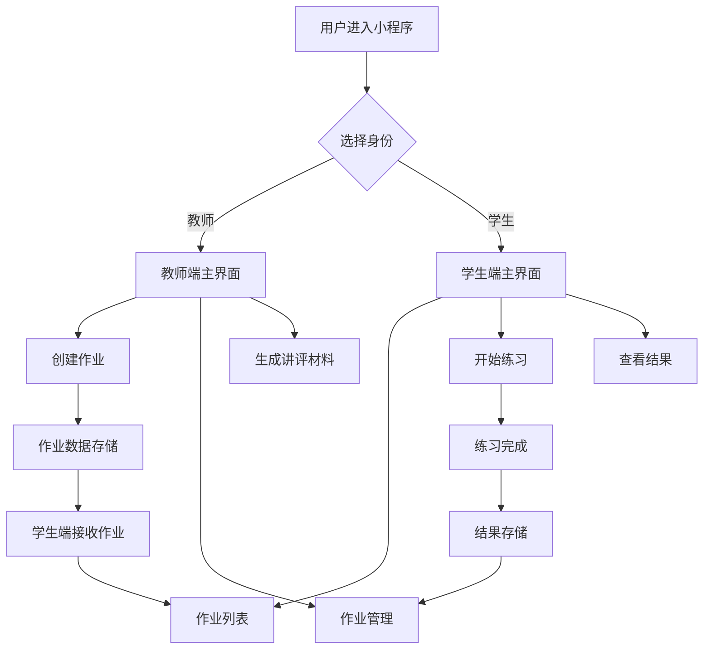
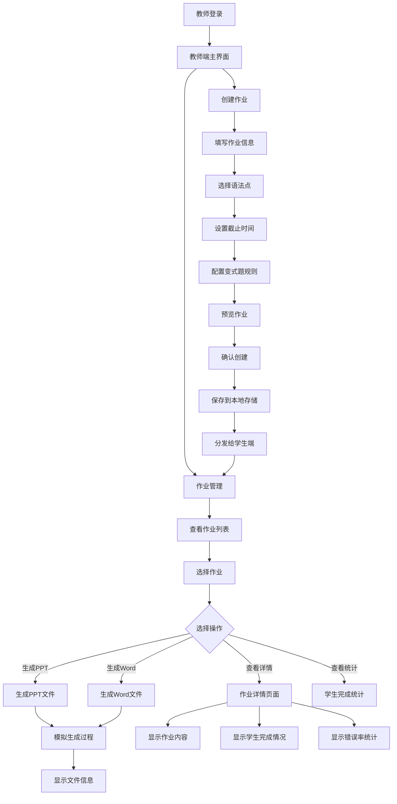
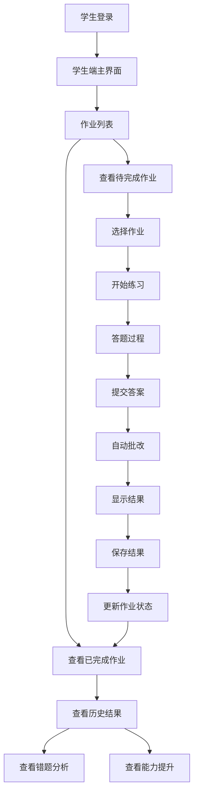
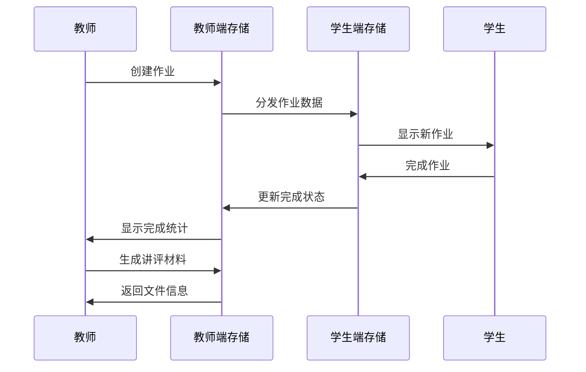
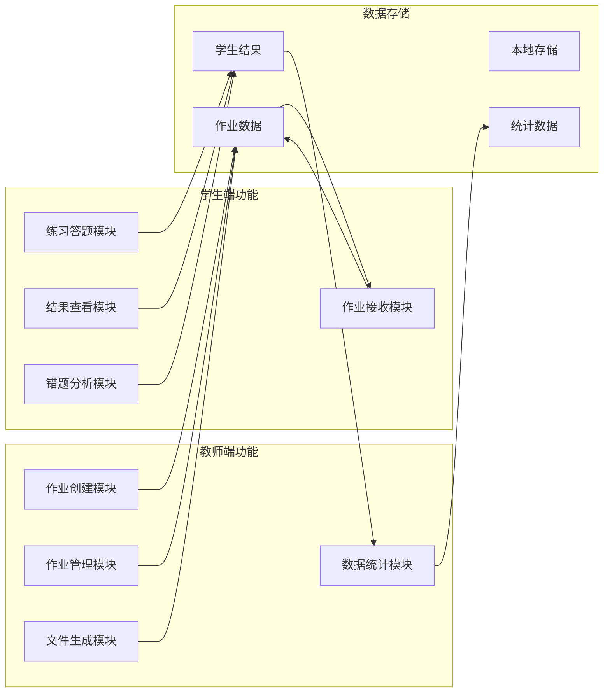
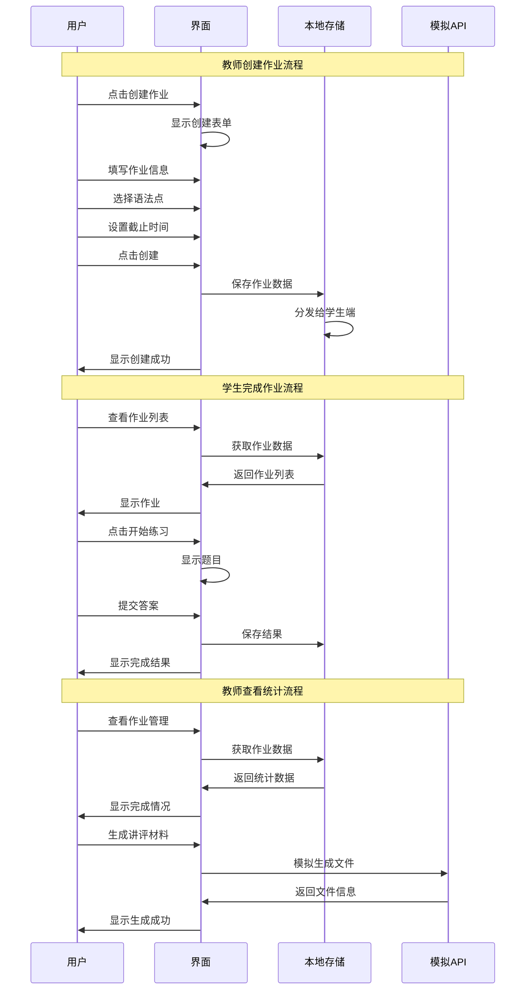
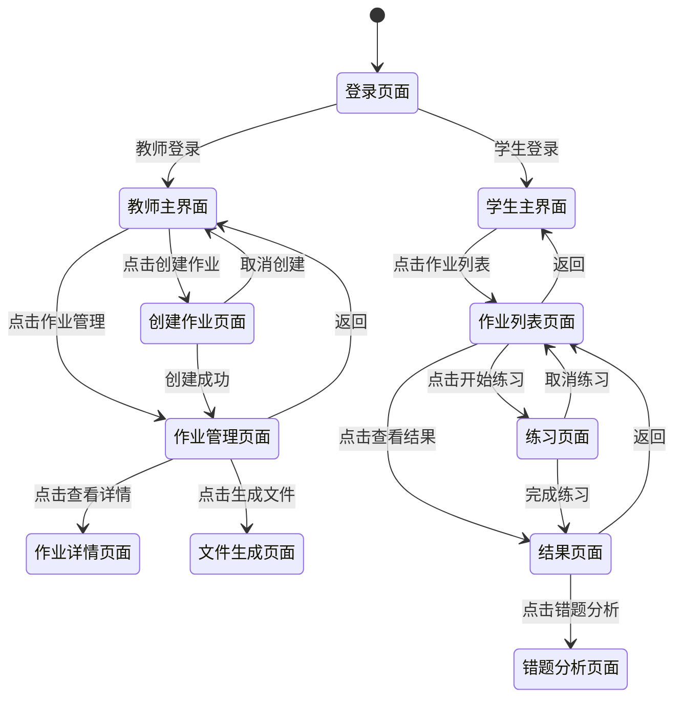
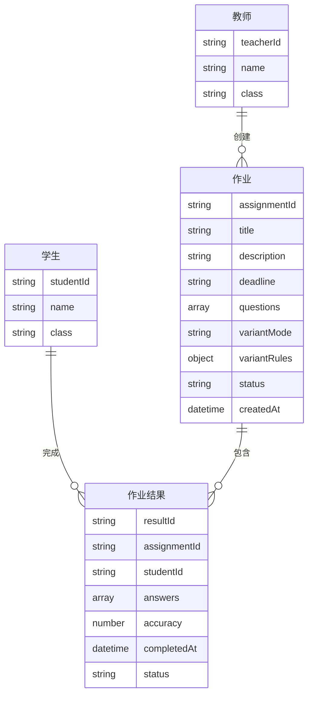

# 教师学生界面交互流程图

## 系统整体架构图

## 教师端详细流程图

## 学生端详细流程图

## 数据流转图

## 核心功能模块图

## 用户操作时序图

## 界面状态转换图

## 数据模型关系图

## 功能特性说明

### 教师端核心功能
1. **作业创建**：支持语法点选择、截止时间设置、变式题配置
2. **作业管理**：查看所有作业状态、学生完成情况、统计数据
3. **文件生成**：生成PPT和Word格式的讲评材料
4. **数据统计**：查看班级整体完成率和正确率

### 学生端核心功能
1. **作业接收**：自动接收教师分配的作业
2. **在线练习**：支持语法选择题练习
3. **自动批改**：实时显示答题结果和正确率
4. **结果查看**：查看历史作业完成情况

### 数据存储机制
1. **本地存储**：使用微信小程序本地存储API
2. **数据同步**：教师创建作业后自动同步到学生端
3. **状态管理**：实时更新作业完成状态和统计数据

### 用户体验优化
1. **简化界面**：隐藏不必要的功能按钮
2. **清晰导航**：明确的页面跳转和返回逻辑
3. **即时反馈**：操作后立即显示结果和状态
4. **错误处理**：友好的错误提示和异常处理
