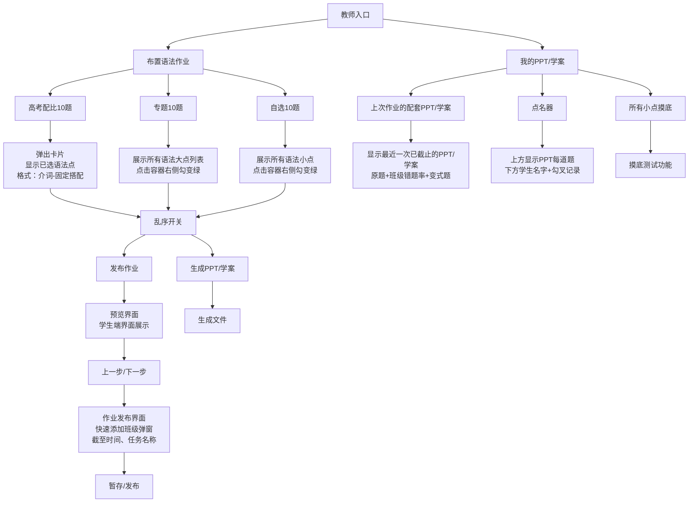
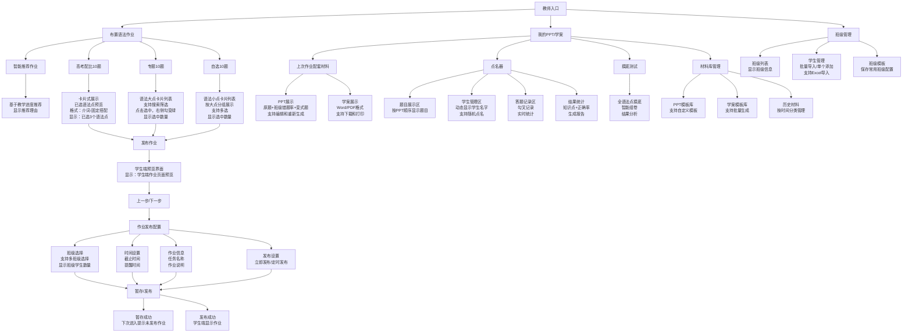

# 教师界面设计流程图

## 您的原始构想流程图

## 改进后的教师界面流程图

## 关键改进点对比

### 1. 学生名称录入优化

**您的构想：** 快速添加班级弹窗
**改进建议：**
- 支持多种导入方式：手动输入、Excel导入、微信班级群导入
- 智能提示和历史记录
- 班级模板保存和复用
- 学生信息管理（姓名、学号、备注）

### 2. PPT/学案保存功能

**您的构想：** 用户自己保存
**改进建议：**
- 云端自动保存，多设备同步
- 版本管理，支持回退
- 模板库，提高效率
- 分享功能，支持协作

### 3. 三个作业类型显示优化

**您的构想：** 弹出卡片展示
**改进建议：**
- 卡片式设计，信息更清晰
- 实时显示选中数量
- 支持搜索和筛选
- 智能推荐相关语法点

### 4. 点名器功能增强

**您的构想：** 基础点名功能
**改进建议：**
- 支持多种点名模式：随机、按顺序、按成绩
- 实时答题统计
- 生成详细报告
- 支持课堂互动功能

### 5. 文件格式建议

**PPT格式：**
- 适合课堂展示
- 支持动画效果
- 便于修改和更新

**PDF格式：**
- 适合打印分发
- 格式稳定，兼容性好
- 文件大小适中

**Word格式：**
- 适合编辑修改
- 便于个性化调整
- 支持批注和评论

## 技术实现建议

### 1. 数据存储
- 使用微信云开发存储学生信息和作业数据
- 本地缓存重要数据，支持离线使用
- 实现数据同步和备份机制

### 2. 文件生成
- 使用模板引擎生成PPT/Word文件
- 支持自定义模板和样式
- 实现批量生成和下载功能

### 3. 用户体验
- 实现流畅的动画过渡效果
- 支持手势操作和快捷操作
- 提供操作引导和帮助提示

### 4. 性能优化
- 实现懒加载和分页加载
- 优化图片和文件加载速度
- 支持离线缓存和预加载
