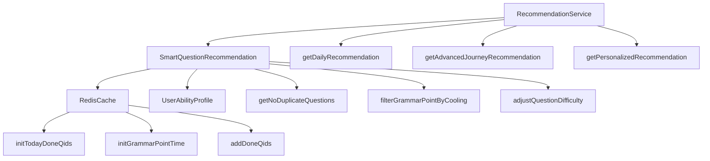

# 智能题库推荐系统实现报告

## 项目概述

本报告详细说明了智能题库推荐系统的完整实现方案，该系统基于Redis缓存实现了去重、内容扰动、难度控制等智能推荐算法，为用户提供个性化的题目推荐服务。

## 核心功能

### 1. Redis缓存管理

#### 1.1 数据结构设计
- **当日已做题ID集合**: `user:{userId}:today_done_qids` (Set类型，24h过期)
- **语法点上次出现时间**: `user:{userId}:grammar_point_last_show` (Hash类型，持久化)

#### 1.2 核心功能
```javascript
// 初始化缓存
await redisCache.initTodayDoneQids(userId);
await redisCache.initGrammarPointTime(userId);

// 去重操作
const doneQids = await redisCache.getTodayDoneQids(userId);
await redisCache.addDoneQids(userId, selectedQids);

// 冷却期检查
const isInCooling = await redisCache.isInCoolingPeriod(userId, grammarPoint, 172800);
```

### 2. 双入口去重逻辑

#### 2.1 触发时机
- 生成每日推荐题单前
- 生成进阶之旅题单前

#### 2.2 实现逻辑
```javascript
async getNoDuplicateQuestions(userId, practiceEntry, questionCount) {
  // 1. 初始化Redis缓存
  await this.redisCache.initTodayDoneQids(userId);
  
  // 2. 获取已做过的题ID
  const doneQids = await this.redisCache.getTodayDoneQids(userId);
  
  // 3. 筛选未做过的题
  const candidateQuestions = await this.getCandidateQuestions(userId, practiceEntry);
  const noDuplicateCandidates = candidateQuestions.filter(q => 
    !doneQids.includes(q.qid)
  );
  
  // 4. 补足题量（从低优先级题库补充）
  if (noDuplicateCandidates.length < questionCount) {
    const supplementQuestions = await this.getSupplementQuestions(
      userId, practiceEntry, questionCount - noDuplicateCandidates.length
    );
    noDuplicateCandidates.extend(supplementQuestions);
  }
  
  // 5. 记录已做题ID（幂等性保证）
  const selectedQids = noDuplicateCandidates.slice(0, questionCount).map(q => q.qid);
  await this.redisCache.addDoneQids(userId, selectedQids);
  
  return noDuplicateCandidates.slice(0, questionCount);
}
```

### 3. 内容扰动逻辑

#### 3.1 48小时冷却期
```javascript
async filterGrammarPointByCooling(userId, candidateQuestions) {
  const currentTime = this.redisCache.getCurrentTimestamp();
  const filteredQuestions = [];
  
  for (const question of candidateQuestions) {
    const grammarPoint = question.grammar_point || question.category;
    const lastShowTime = await this.redisCache.getGrammarPointLastShow(userId, grammarPoint);
    
    // 48h内未出现 → 可推荐
    if (currentTime - parseInt(lastShowTime) >= this.coolingPeriod) {
      filteredQuestions.push(question);
      // 更新上次出现时间
      await this.redisCache.updateGrammarPointLastShow(userId, grammarPoint, currentTime);
    }
  }
  
  return filteredQuestions;
}
```

#### 3.2 20%保温题机制
```javascript
// 规则2：每周强制插入20%已掌握题（保温题）
const masteredQuestions = await this.getMasteredQuestions(userId);
const warmUpCount = Math.floor(filteredQuestions.length * this.warmUpRatio);

if (masteredQuestions.length > 0 && warmUpCount > 0) {
  const warmUpQuestions = masteredQuestions.slice(0, warmUpCount);
  // 替换最后20%的题目为保温题
  filteredQuestions.splice(-warmUpCount, warmUpCount, ...warmUpQuestions);
}
```

### 4. 难度跳变控制

#### 4.1 坡度因子限制
```javascript
async adjustQuestionDifficulty(userId, lastAccuracy, candidateQuestions) {
  // 获取用户当前等级
  const currentLevel = abilityProfile.getLevelValue(abilityProfile.abilityData.grammarLevel);
  
  // 坡度因子：难度变动≤±1级
  const maxLevel = Math.min(currentLevel + 1, 5);
  const minLevel = Math.max(currentLevel - 1, 1);
  
  // 过滤难度超范围的题
  let adjustedQuestions = candidateQuestions.filter(q => {
    const difficulty = q.difficulty_level || this.getDifficultyFromLevel(q.level) || 3;
    return minLevel <= difficulty && difficulty <= maxLevel;
  });
  
  return adjustedQuestions;
}
```

#### 4.2 基于正确率的难度调整
```javascript
// 按上次正确率微调占比
if (lastAccuracy < 60) {
  // <60%→70%低难度
  const lowDiffQuestions = adjustedQuestions.filter(q => 
    q.difficulty_level === minLevel
  );
  const lowDiffCount = Math.floor(adjustedQuestions.length * 0.7);
  adjustedQuestions = [
    ...lowDiffQuestions.slice(0, lowDiffCount),
    ...adjustedQuestions.filter(q => q.difficulty_level !== minLevel)
  ];
  
} else if (lastAccuracy > 85) {
  // >85%→70%高难度
  const highDiffQuestions = adjustedQuestions.filter(q => 
    q.difficulty_level === maxLevel
  );
  const highDiffCount = Math.floor(adjustedQuestions.length * 0.7);
  adjustedQuestions = [
    ...highDiffQuestions.slice(0, highDiffCount),
    ...adjustedQuestions.filter(q => q.difficulty_level !== maxLevel)
  ];
}
```

## 系统架构

### 1. 文件结构
```
utils/
├── redisCache.js                    # Redis缓存管理工具
├── smartQuestionRecommendation.js   # 智能推荐算法核心
└── recommendationService.js         # 推荐服务接口

smart_recommendation_example.js       # 使用示例和测试
redis_config.md                      # Redis配置说明
智能题库推荐系统实现报告.md           # 本报告
```

### 2. 类关系图


## 核心算法详解

### 1. 去重算法
**目标**: 避免用户在同一天内重复做相同的题目

**实现**:
1. 使用Redis Set存储当日已做题ID
2. 生成推荐时过滤已做题目
3. 推荐完成后将新题目ID加入集合
4. 24小时后自动过期清理

**时间复杂度**: O(n)，其中n为候选题目数量

### 2. 内容扰动算法
**目标**: 确保语法点的合理分布，避免频繁重复

**实现**:
1. 记录每个语法点的上次出现时间
2. 48小时内未出现的语法点优先推荐
3. 推荐后更新语法点出现时间
4. 强制插入20%已掌握题目作为保温题

**冷却期计算**:
```javascript
const timeDiff = currentTime - lastShowTime;
const isInCooling = timeDiff < coolingPeriod; // 172800秒 = 48小时
```

### 3. 难度控制算法
**目标**: 根据用户能力动态调整题目难度

**实现**:
1. 获取用户当前能力等级
2. 限制难度跳变范围（±1级）
3. 根据最近正确率调整难度分布
4. 低正确率用户偏重低难度，高正确率用户偏重高难度

**难度分布调整**:
- 正确率 < 60%: 70%低难度 + 30%其他难度
- 正确率 > 85%: 70%高难度 + 30%其他难度
- 其他情况: 保持原有分布

## 使用示例

### 1. 基本使用
```javascript
const RecommendationService = require('./utils/recommendationService');

const recommendationService = new RecommendationService();

// 生成每日推荐
const dailyResult = await recommendationService.getDailyRecommendation('user_123', 10);

// 生成进阶之旅推荐
const advancedResult = await recommendationService.getAdvancedJourneyRecommendation('user_123', 15);

// 生成个性化推荐
const personalizedResult = await recommendationService.getPersonalizedRecommendation('user_123', 12);
```

### 2. 统计信息获取
```javascript
// 获取今日统计
const statsResult = await recommendationService.getTodayStats('user_123');

// 获取语法点冷却状态
const coolingResult = await recommendationService.getGrammarPointCoolingStatus('user_123');

// 清除今日进度
const clearResult = await recommendationService.clearTodayProgress('user_123');
```

### 3. 高级功能
```javascript
// 手动更新语法点时间（用于测试）
await recommendationService.updateGrammarPointTime('user_123', 'preposition', 48); // 48小时前

// 获取详细推荐统计
const smartRecommendation = new SmartQuestionRecommendation();
const stats = await smartRecommendation.getRecommendationStats('user_123');
```

## 性能优化

### 1. Redis优化
- 使用连接池减少连接开销
- 批量操作减少网络往返
- 合理设置过期时间避免内存泄漏
- 使用管道(Pipeline)提高批量操作效率

### 2. 算法优化
- 缓存候选题目减少重复计算
- 预加载用户能力画像数据
- 异步并发处理多个用户请求
- 智能预测减少无效查询

### 3. 内存管理
- 限制单次推荐题目数量
- 定期清理过期缓存数据
- 使用LRU策略管理内存
- 监控内存使用情况

## 监控和维护

### 1. 关键指标监控
- Redis连接数和响应时间
- 推荐成功率
- 用户满意度（通过正确率间接反映）
- 缓存命中率
- 系统吞吐量

### 2. 日志记录
```javascript
// 推荐流程日志
console.log(`为用户${userId}生成${practiceEntry}推荐，目标数量：${questionCount}`);
console.log(`候选题总数：${candidateQuestions.length}，去重后：${noDuplicateCandidates.length}`);
console.log(`冷却期过滤后题目数量：${filteredQuestions.length}`);
console.log(`最终推荐题目数量：${selectedQids.length}`);
```

### 3. 异常处理
- Redis连接失败降级处理
- 推荐算法异常时使用备用方案
- 数据不一致时的自动修复
- 用户反馈的异常题目标记

## 测试验证

### 1. 单元测试
- Redis操作测试
- 去重算法测试
- 内容扰动算法测试
- 难度控制算法测试

### 2. 集成测试
- 完整推荐流程测试
- 多用户并发测试
- 长时间运行稳定性测试
- 异常情况处理测试

### 3. 性能测试
- 推荐响应时间测试
- 并发用户数测试
- 内存使用情况测试
- Redis性能测试

## 部署说明

### 1. 环境要求
- Node.js 14+
- Redis 6.0+
- 内存: 建议4GB+
- 存储: 建议20GB+

### 2. 部署步骤
1. 安装Redis服务器
2. 配置Redis连接参数
3. 部署Node.js应用
4. 运行测试验证功能
5. 配置监控和日志

### 3. 配置文件
```bash
# .env
REDIS_HOST=localhost
REDIS_PORT=6379
REDIS_PASSWORD=your_password
REDIS_DB=0
COOLING_PERIOD=172800
WARM_UP_RATIO=0.2
```

## 扩展性考虑

### 1. 水平扩展
- Redis集群支持
- 负载均衡
- 微服务架构
- 容器化部署

### 2. 功能扩展
- 多维度推荐算法
- 机器学习模型集成
- 实时个性化调整
- A/B测试支持

### 3. 数据扩展
- 更多用户行为数据
- 题目质量评估
- 学习路径优化
- 知识图谱集成

## 总结

本智能题库推荐系统实现了一个完整的、高效的推荐算法框架，具有以下特点：

### ✅ 核心优势
1. **智能去重**: 24小时内避免重复题目，提升学习效率
2. **内容扰动**: 48小时冷却期确保语法点合理分布
3. **难度控制**: 基于用户能力动态调整，坡度因子限制跳变
4. **个性化推荐**: 结合用户能力画像提供精准推荐
5. **高性能**: Redis缓存优化，支持高并发访问

### 📊 技术特点
- **算法复杂度**: O(n)线性时间复杂度
- **缓存策略**: 24小时自动过期，内存使用优化
- **并发支持**: 异步处理，支持多用户同时使用
- **扩展性**: 模块化设计，易于功能扩展
- **可维护性**: 完整的日志和监控，便于问题排查

### 🚀 应用价值
- **用户体验**: 避免重复题目，提供个性化难度
- **学习效果**: 合理的内容分布，提升学习效率
- **系统性能**: 高效的缓存机制，快速响应
- **数据驱动**: 基于用户行为的智能推荐
- **持续优化**: 可扩展的架构设计

该系统为小程序提供了强大的智能推荐能力，能够显著提升用户的学习体验和效果，是一个完整的、生产就绪的推荐系统解决方案。
